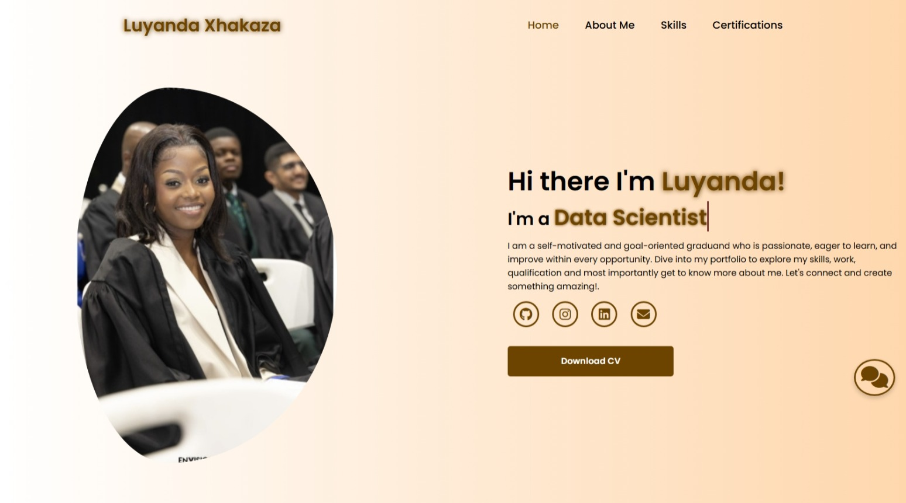

# My-Portfolio


[](https://tangerine-heliotrope-2fcc1f.netlify.app/)
[](LICENSE)



Welcome to my interactive professional portfolio showcasing my technical skills, academic achievements, and professional certifications. This responsive website features chatbot assistant to enhance user engagement.

## Table of Contents
- [Live Demo](#live-demo)
- [Key Features](#key-features)
- [Project Structure](#project-structure)
- [Pages Overview](#pages-overview)
- [Technical Stack](#technical-stack)
- [Local Setup](#local-setup)
- [License](#license)

## Live Demo

Experience the full portfolio:  
🌐 [https://tangerine-heliotrope-2fcc1f.netlify.app/](https://tangerine-heliotrope-2fcc1f.netlify.app/)

## Key Features

### User Experience
🤖 **Smart Chatbot** - Instant answers about my background 
📥 **One-Click CV** - Download my resume in PDF format  
📜 **Certification Hub** - Interactive gallery with 11 professional certificates  
📊 **Skill Metrics** - Visual proficiency indicators for 12+ technical skills  

### Technical Excellence
⚡ **Lightweight** - Pure HTML/CSS/JS with zero dependencies  
🎨 **Themeable** - Easy color scheme customization via CSS variables  

## Project Structure
My-Portfolio/
├── index.html # Main landing page
├── about.html # Professional background
├── skills.html # Skills visualization
├── certifications.html # Certificates showcase
├── index.js # Chatbot & interactivity
├── style.css # Complete styling
├── luyanda_xhakaza.pdf # Professional resume
├── README.md # Documentation
├── LICENSE # MIT License
├── main.jpeg # Hero banner
├── IMG_3075.jpeg # Profile photo
├── bot.jpg # Chatbot avatar
├── user.jpg # User chat icon
├── IMG_5179.jpeg 
├── IMG_5180.jpeg 
├── IMG_5181_(1).jpeg 
├── IMG_5181.jpeg 
├── IMG_5183.jpeg 
├── IMG_5184.jpeg 
├── IMG_5186.jpeg 
├── IMG_5187.jpeg 
├── solo1.png 
├── solo2.png 
└── udemy.jpg 


## Pages Overview

| Page | Key Components |
|------|----------------|
| **Home** | Animated intro, social links, chatbot access |
| **About** | Education timeline, project highlights, bio |
| **Skills** | 6 technical + 6 soft skills with progress bars |
| **Certifications** | 11 certificates with modal viewing |

## Technical Stack

**Core Technologies:**
- HTML5 (Semantic Structure)
- CSS3 (Flexbox/Grid Layouts)
- JavaScript (ES6+ Features)

**Integrations:**
- Font Awesome 6.7.1 (Icons)
- Google Fonts (Poppins Typography)

**Development Tools:**
- GitHub (Version Control)
- Netlify (Continuous Deployment)

## Local Setup

1. Clone repository:
```bash
git clone https://github.com/luyandaaaa/My-Portfolio.git

License
This project is licensed under the MIT License - free for personal and commercial use with attribution.

📬 Contact: lloyiswa2003@gmail.com
